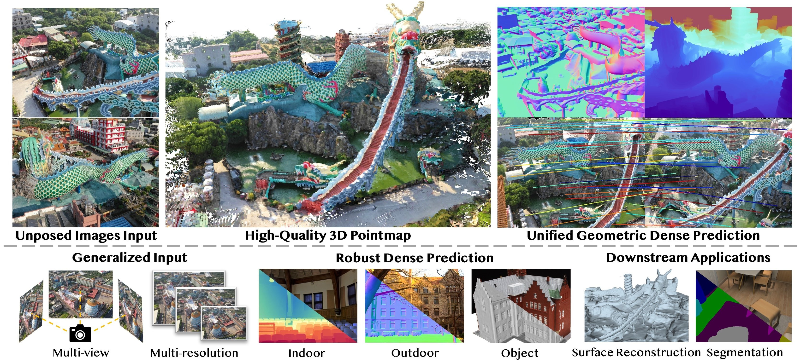

# Dens3R
### [[Paper (Coming Soon)]]() [[Project Page]](https://g-1nonly.github.io/Dens3R/) [[Demo (Coming Soon)]]() 

> [**Dens3R: A Foundation Model for 3D Geometry Prediction**](),            
> Xianze Fang<sup>1*</sup>, [Jingnan Gao<sup>2*</sup>](https://g-1nonly.github.io), Zhe Wang<sup>1</sup>, Zhuo Chen<sup>2</sup>, [Xingyu Ren<sup>2</sup>](https://xingyuren.github.io), Jiangjing Lyu<sup>1†</sup>, Qiaomu Ren<sup>1</sup>, Zhonglei Yang<sup>1</sup>, [Xiaokang Yang<sup>2</sup>](https://english.seiee.sjtu.edu.cn/english/detail/842_802.htm), [Yichao Yan<sup>2‡</sup>](https://daodaofr.github.io/), Chengfei Lyu <br>
> **<sup>1</sup> Alibaba Group <sup>2</sup>Shanghai Jiao Tong University** <br>
> *Equal contribution  † Project leader  ‡ Corresponding author

Official implementation of "Dens3R: A Foundation Model for 3D Geometry Prediction".

<div align="center">
  
</div><br/>

## Code Coming Soon.

## BibTeX
```bibtex
@article{dens3r,
  title={Dens3R: A Foundation Model for 3D Geometry Prediction}, 
  author={Xianze Fang and Jingnan Gao and Zhe Wang and Zhuo Chen and Xingyu Ren and Jiangjing Lyu and Qiaomu Ren and Zhonglei Yang and Xiaokang Yang and Yichao Yan and Chengfei Lyu},
  journal={arXiv preprint arXiv:},
  year={2025}
}
```
